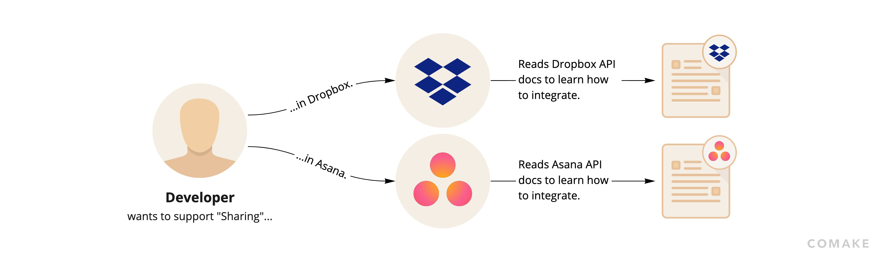
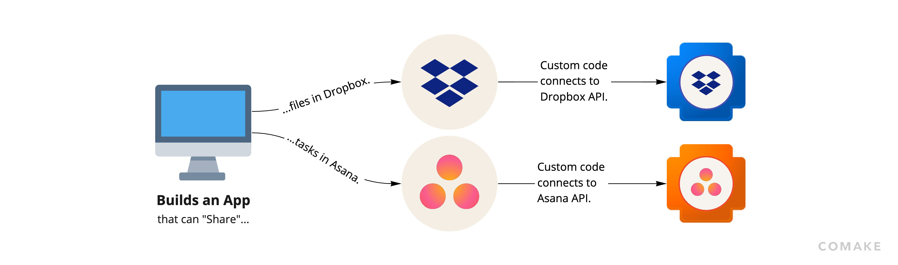
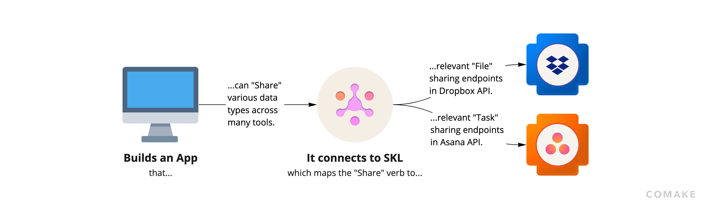

# Standard Knowledge Language

Standard Knowledge Language (SKL) is an open source framework for integrating software tools and enabling interoperability. It allows you to connect to and use data by what it represents rather than where it's stored.

This documentation provides an introduction for developers who want to integrate data from other software tools into their applications using SKL.

## Overview

Today, people lack clarity because each app they work with only shows them a partial view of their work. Trying to offer a holistic and integrated experience is hard and results in a messy web of one-to-one integrations that is hard to maintain. This is true both for companies trying to consolidate data between tools they use internally, and for software companies wanting to let their users push or pull data to or from other software tools.

Developers commonly use SDKs or other code packages (node modules, ruby gems, etc.) to interact with the API of a software tool they want to integrate into their application. These methods provide convenience over having to writing code to communicate directly using HTTP requests but still have limitations. Due to resource constraints, software tools may not have an SDK or code package targeting every programming language or execution environment a developer may be programming their application in. Even if they find suitable wrappers for the API they wish to interact with, developers are still left with the task of reading API documentation to know how to translate the unique data formats and capabilities of each API to the data formats and features of their application. This is not a trivial task, especially as the number of integrations they need increases.

The data integration problems outlined above are not new. Over a decade ago, Tim Berners Lee (colloquially known as the founder of the internet), proposed the concept of Linked Data to mitigate data integration issues. Linked Data was to provide a format that is both machine and human readable, allowing different software tools and their creators to have a common understanding of data and what it represents. Unfortunately, it did not gain as strong of a following by tech companies as many would have hoped and is not used widely today.

There are still proponents who call upon tech companies to convert their APIs or build Linked Data compatible versions of their APIs. There are also proponents for establishing standard API features that solve for common capabilities across APIs so that software tools and developers can more easily access similar features by attributes of the feature rather than of the API.

The success of proposed methods is dependent on developers at different companies collectively agreeing to architect their APIs according to a shared criteria that doesn’t yet exist and that could limit their innovation or development cycles. In the fast-moving world of software startups, convincing enough companies to invest in the collective establishment of these standards (sometimes in concert with their competitors) is hard to do. Large companies are also at times loath to convert to more standard data formats, ontologies, and APIs because they amass great value by controlling the flow of data through and within their ecosystems, in part through proprietary APIs. The silos of data that arise through competing technology ecosystems ultimately lead to vendor lock-in that can stifle users’ range of capabilities and broader software innovation.

There is no perfect ontology for all use cases, and part of the value of Linked Data is that anyone can easily create their own or contribute to existing ontologies. For those software tools that do choose to invest in building Linked Data APIs, this independent proliferation of various (and sometimes competing) ontologies of Linked Data can make it so that there is still a lot of manual work that has to be done by humans to integrate data which is formatted according to different ontologies. An important missing piece is therefore the standard translation across various ontologies, representations of data, and software capabilities.

Standard Knowledge Language solves these problems by defining a protocol for interacting with non-standard data formats and APIs through standard abstractions of data and capabilities. Unlike the approaches described above, SKL does not require existing API providers to change their APIs or offerings. Instead, it provides a streamlined way for developers to easily connect to a theoretically infinite number of APIs simultaneously.

Specifically, Standard Knowledge Language defines:
- **Nouns**: schemas for data structures representing concepts commonly used by software tools.
- **Verbs**: schemas representing capabilities exposed by software tools (and their parameters and return values).
- **Mappings**: sets of configurations which dictate how a program can translate between Nouns and Verbs and the unique API of any software tool.

The Nouns, Verbs and Mappings of SKL make it so that:
- Data can be understood by what it represents rather than relying on where it comes from or where it is stored. This is done using Nouns.
- A developer, end user, or application can perform operations on/with any given Noun(s) regardless of where the data comes from or how it’s stored.
- A developer, end user, or application can easily discover what Verbs (i.e. software capabilities) can be used over any given piece of data (i.e. a Noun) and vice versa.
- Complex workflows, applications, and automations which integrate data from multiple tools (i.e., Integrations) can be easily built and customized with Nouns and Verbs such that they don’t have to interact with tool specific APIs.

## Conceptual Example

Imagine you are building a workplace chat software product that brings teams together and empowers them deliver work more efficiently in an asynchronous way. Your app does this by helping team members organize their communication into conversations with a dedicated purpose (e.g., a channel dedicated to a given project). Naturally, your users end up sharing and discussing relevant information, links to research, docs, presentations, and more with each other through your chat tool.

Currently, when your users share a link to a file or a task with someone, your app has no way of knowing if the person your user sent the link to actually has access to the file or task. The sender of that link has no way of checking or controlling whether the receiver of the link can access its contents without leaving your app. The receiver often has to check their email for sharing notifications, which reduces the value of your app. Overall, this process can result in some back and forth between the sender and receiver trying to coordinate the shared element’s permissions, which leads to lost productivity for your end users, and which can ultimately hurt your product’s chance at success in the market.

You decide that a better, more integrated solution, is one that automatically checks the permissions of the shared element when a user sends it. If your app identifies that the receiver doesn’t have access to the shared element, then your app immediately prompts the sender about modifying the permissions accordingly within your interface. In this way the sender and the receiver save time in achieving the desired result, your app is appreciated for streamlining that process, and the value of consolidating all related work in a contextual conversation is achieved.

##### How to solve this problem without SKL:

As you plan for how to build this with your available resources, you likely need to decide which integrations are the most valuable and which to prioritize. You start to evaluate which tools are most prevalent amongst your users and identify Dropbox and Asana as the top two, so you decide to build those integrations first.

Your immediate next step is likely to look through the API documentation for each tool in order to understand if and how they support the functionality you want to offer. You find that Dropbox provides unique API endpoints with custom arguments to manage permissions and sharing, and that Asana similarly has its own custom API endpoints and formats. Ultimately you confirm that they both support the functionality you want, albeit in different ways.

As you move past research and into planing and execution, you likely start to write out the logic for potential functions and processes in your app’s code that can call the respective endpoints for each of these APIs. You look for and install SDKs for Asana and Dropbox that match the programming language your app is written in and start building out some methods to test. You try to architect your system with maximum modularity, but ultimately end up having to create different functions that call the respective SDKs and/or APIs for each integration you want to support. Finally, you have to test that each of these functions works well and debug each until it performs as desired.

Woohoo! You’re ready to release your first two integrations, and once you do, your users love it! They ask you to do the same type of integration for twenty other apps. You quickly realize that your success has created a lot more work and you go back to thinking about how to build the next ones.

Looking back, you recognize how much more time integrating the first two took than you would have liked. In many cases, this processes is measured in weeks or months (or even years in particular circumstances) from the start of research, through planning, execution, testing, and the final production-ready release.

As you move on to the next integrations you hope the process is faster and simpler than before, however, you still need to research each new tool’s API, find SDKs that exist in your programming language, create new functions that call the SDKs or APIs in order to achieve a desired result, test them, and so on. This ultimately proves to be a lot of work for each new integration, and perhaps you begin to think… Could there be a better way?

We experienced these exact problems ourselves trying to build and manage integrations for years, and we knew others were struggling with them too. We decided to address the issues from the ground up by rethinking software integration entirely. The result is SKL, a holistic and open source integration framework that works the way you think.

##### How to solve this problem with SKL:

Going back to the moment that you decide you want your users to be able to share work elements from other tools within your app’s interface…

Imagine that you decide to use SKL. Instead of choosing a few specific tools to build your first integrations with and researching each of their third-party APIs, now you simply have to look through the Standard Knowledge Language Dictionary for the intended capability that you want to support.

You want your users to be able to “share” work elements from other apps, so you start by searching for a [Verb](./fundamentals.md#verbs) called “share” in the SKL Dictionary. If the Verb you are looking for exists, you can install an [SKL Engine](./engine.md) and start using the Verb right away to access the sharing capabilities from third-party tools that support sharing. As you will see below, this can drastically improve your ability to quickly build and easily manage integrations for “sharing”.

In the event that the “share” Verb is missing, SKL empowers you to easily create its definition without having to write any code or deal with any infrastructure. Similarly, if any [Mapping](./fundamentals.md#mappings) between a desired third party tool and the “share” Verb is missing, you can easily add the new integration in a matter of minutes.

By using SKL, you are able to reference the “share” Verb directly within your code. This means that you don’t have to write out any unique code or logic for each third-party integration. Your app’s code doesn’t need to have any custom code that deals with third-party SDKs or APIs. Instead, you are now able to build all your application logic over the “share” Verb which abstracts and standardizes the capabilities from a potentially infinite number of unique third-party “sharing” endpoints. This abstraction is a small but crucial change that fundamentally improves your ability to build and maintain integrations.

Now, nothing has to be repeated every time you build a new integration! All that you have to do is find or create a [Mapping](./fundamentals.md#mappings) between SKL’s standard “share” Verb and the sharing endpoint within each desired integration. You are now able to build each of your next twenty integrations in a matter of minutes, rather than weeks or months!

Another key difference is that SKL Schemas, including the “share” Verb, are defined through configuration, not some specific programming language. This makes it so that you can use the convenience of SKL regardless of whether your app is written in Python or JavaScript.
