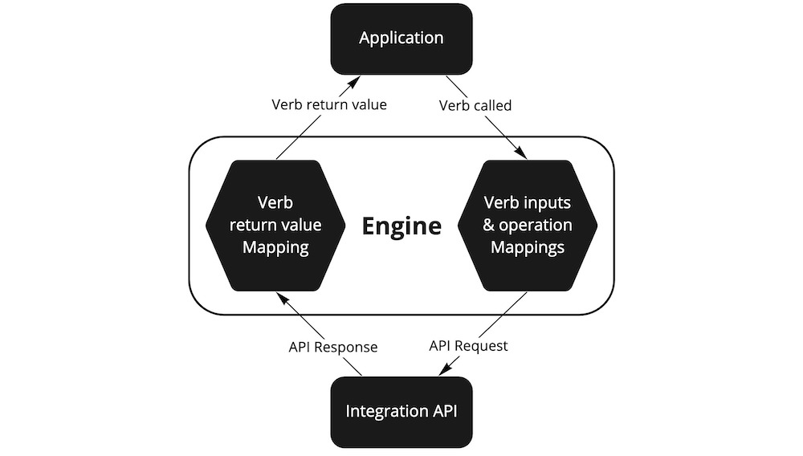

An SKL Engine is a code package that allows developers to call Verbs and Mappings defined in SKL Schemas from code.

This guide introduces some of the key features an SKL Engine should implement to adhere to the SKL specification. A more detailed SKL specicifcation will be released soon.

## Implementation

The essential requirements of an Engine are:
1. Allow developers to set a source of schemas.
2. Allow developers to call Verbs.

In addition to these two requirements, an Engine may also expose the ability to create and update SKL Schemas in the schema source.

### Schema source

A developer using an Engine should be able to set the source of the schemas they want the Engine to use at any time via one or several options:
- supplied via a variable
- read from a file
- queried from an SKDS (see [Ecosystem](./ecosystem.md) for more info)

 All examples in this section use the prebuilt Javascript SKL Engine. 

Supplied via a variable:
```javascript
const schema = [ ... ];
const engine = new SKLEngine({ 
  type: 'memory',
  schemas: schema
});
```

Queried from an SKDS:
```javascript
const engine = new SKLEngine({ 
  type: 'sparql',
  endpointUrl: 'https://myskds.standard.storage/'
});
```

### Verbs

An Engine should support calling Verbs using functions with the same name as the Verb. For example:
```javascript
const files = await engine.getFilesInFolder({ account, folder });
```

The Engine may also allow Verbs to be called on entities. When used this way, the entity on which the Verb is called must be one of the Verb's expected parameters. For example the following statements should be equivalent to the one above:
```javascript
const files = folder.getFilesInFolder({ account });
const files = account.getFilesInFolder({ folder });
```

In all three cases, the Engine would call the [`getFilesInFolder`](https://github.com/comake/skl-dictionary/blob/main/verbs/getFilesInFolder/schema.json) Verb with an Account and a Folder as parameters.

This diagram gives more detail about the procedure an Engine should take when a Verb is executed:



The procedure follows these steps:

1. Find the configuration for the Verb from the currently set schema source.
2. Ensure the validity of the parameters supplied according to the [SHACL Shape](https://www.w3.org/TR/shacl/) identified by the Verb’s `parameters` property.
3. Find the configuration for the VerbToIntegrationMapping that relates the Verb to the Integration of the Account parameter from the currently set schema source.
3. Perform the parameter and operation [RML](https://rml.io/) Mapping(s) - defined in the Mapping's `parameterMappings` and `operationMappings` properties respectively - to obtain the unique parameters and operation to perform the Verb using an Integration's API.
4. Perform the Verb’s operation using the Integration's API.
5. Obtain the response from performing the Verb’s operation.
6. Perform the return value [RML](https://rml.io/) Mapping(s) - defined in the Mapping's `returnValueMappings` property - to obtain the return value of the Verb.
7. Ensure the validity of the return value according to the [SHACL Shape](https://www.w3.org/TR/shacl/) identified by the Verb’s `returnValue` property.
8. Return the output of the Verb.


If ever a Verb or a Mapping cannot be found by querying the currently set schema source, the Engine must throw an error.



Execution of [RML](https://rml.io/) Mappings can be performed using an existing RML processor, such as:
- [RMLMapper](https://github.com/RMLio/rmlmapper-java) - an open source Java library to execute RML rules via Java or the command line.
- [rmlmapper-java-wrapper-js](https://github.com/RMLio/rmlmapper-java-wrapper-js) - an open source JavaScript library offering a wrapper around the [Java RMLMapper](https://github.com/RMLio/rmlmapper-java).
- [RocketRML](https://github.com/semantifyit/RocketRML) - an open source Javascript library to execute RML rules.
- [rmlmapper-webapi-js](https://github.com/RMLio/rmlmapper-webapi-js) - an open source library that sets up a web server as a wrapper around the [Java RMLMapper](https://github.com/RMLio/rmlmapper-java).

You can see more RML processors on the [RML Implementation Report](https://rml.io/implementation-report/).



Validation of [SHACL Shapes](https://www.w3.org/TR/shacl/) can be performed using an existing SHACL engine, such as:
- [rdf-validate-shacl](https://github.com/zazuko/rdf-validate-shacl) - an open source SHACL validator written purely in Javascript on top of the [RDFJS](https://rdf.js.org/) stack. Used by our existing SKL Javascript Engine.
- [pySHACL](https://github.com/RDFLib/pySHACL) - an open source SHACL validator library for python.
- [SHaclEX](https://github.com/weso/shaclex) - an open source Scala implementation of SHEX and SHACL.



 <!-- Note about support for different types of operations -->