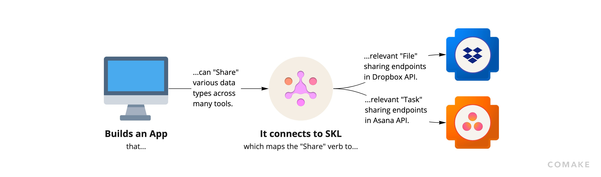

# Conceptual Example

Imagine you are building a workplace chat software product that brings teams together and empowers them deliver work more efficiently in an asynchronous way. Your app does this by helping team members organize their communication into conversations with a dedicated purpose (e.g., a channel dedicated to a given project). Naturally, your users end up sharing and discussing relevant information, links to research, docs, presentations, and more with each other through your chat tool.

Currently, when your users share a link to a file or a task with someone, your app has no way of knowing if the person your user sent the link to actually has access to the file or task. The sender of that link has no way of checking or controlling whether the receiver of the link can access its contents without leaving your app. The receiver often has to check their email for sharing notifications, which reduces the value of your app. Overall, this process can result in some back and forth between the sender and receiver trying to coordinate the shared element’s permissions, which leads to lost productivity for your end users, and which can ultimately hurt your product’s chance at success in the market.

You decide that a better, more integrated solution, is one that automatically checks the permissions of the shared element when a user sends it. If your app identifies that the receiver doesn’t have access to the shared element, then your app immediately prompts the sender about modifying the permissions accordingly within your interface. In this way the sender and the receiver save time in achieving the desired result, your app is appreciated for streamlining that process, and the value of consolidating all related work in a contextual conversation is achieved.

##### How to solve this problem without SKL:

As you plan for how to build this with your available resources, you likely need to decide which integrations are the most valuable and which to prioritize. You start to evaluate which tools are most prevalent amongst your users and identify Dropbox and Asana as the top two, so you decide to build those integrations first.

Your immediate next step is likely to look through the API documentation for each tool in order to understand if and how they support the functionality you want to offer. You find that Dropbox provides unique API endpoints with custom arguments to manage permissions and sharing, and that Asana similarly has its own custom API endpoints and formats. Ultimately you confirm that they both support the functionality you want, albeit in different ways.

As you move past research and into planing and execution, you likely start to write out the logic for potential functions and processes in your app’s code that can call the respective endpoints for each of these APIs. You look for and install SDKs for Asana and Dropbox that match the programming language your app is written in and start building out some methods to test. You try to architect your system with maximum modularity, but ultimately end up having to create different functions that call the respective SDKs and/or APIs for each integration you want to support. Finally, you have to test that each of these functions works well and debug each until it performs as desired.

Woohoo! You’re ready to release your first two integrations, and once you do, your users love it! They ask you to do the same type of integration for twenty other apps. You quickly realize that your success has created a lot more work and you go back to thinking about how to build the next ones.

Looking back, you recognize how much more time integrating the first two took than you would have liked. In many cases, this processes is measured in weeks or months (or even years in particular circumstances) from the start of research, through planning, execution, testing, and the final production-ready release.

As you move on to the next integrations you hope the process is faster and simpler than before, however, you still need to research each new tool’s API, find SDKs that exist in your programming language, create new functions that call the SDKs or APIs in order to achieve a desired result, test them, and so on. This ultimately proves to be a lot of work for each new integration, and perhaps you begin to think… Could there be a better way?

We experienced these exact problems ourselves trying to build and manage integrations for years, and we knew others were struggling with them too. We decided to address the issues from the ground up by rethinking software integration entirely. The result is SKL, a holistic and open source integration framework that works the way you think.

##### How to solve this problem with SKL:

Going back to the moment that you decide you want your users to be able to share work elements from other tools within your app’s interface…

Imagine that you decide to use SKL. Instead of choosing a few specific tools to build your first integrations with and researching each of their third-party APIs, now you simply have to look through the Standard Knowledge Language Dictionary for the intended capability that you want to support.

You want your users to be able to “share” work elements from other apps, so you start by searching for a [Verb](./fundamentals.md#verbs) called “share” in the SKL Dictionary. If the Verb you are looking for exists, you can install an [SKL Engine](./engine.md) and start using the Verb right away to access the sharing capabilities from third-party tools that support sharing. As you will see below, this can drastically improve your ability to quickly build and easily manage integrations for “sharing”.

In the event that the “share” Verb is missing, SKL empowers you to easily create its definition without having to write any code or deal with any infrastructure. Similarly, if any [Mapping](./fundamentals.md#mappings) between a desired third party tool and the “share” Verb is missing, you can easily add the new integration in a matter of minutes.

By using SKL, you are able to reference the “share” Verb directly within your code. This means that you don’t have to write out any unique code or logic for each third-party integration. Your app’s code doesn’t need to have any custom code that deals with third-party SDKs or APIs. Instead, you are now able to build all your application logic over the “share” Verb which abstracts and standardizes the capabilities from a potentially infinite number of unique third-party “sharing” endpoints. This abstraction is a small but crucial change that fundamentally improves your ability to build and maintain integrations.

Now, nothing has to be repeated every time you build a new integration! All that you have to do is find or create a [Mapping](./fundamentals.md#mappings) between SKL’s standard “share” Verb and the sharing endpoint within each desired integration. You are now able to build each of your next twenty integrations in a matter of minutes, rather than weeks or months!

Another key difference is that SKL Schemas, including the “share” Verb, are defined through configuration, not some specific programming language. This makes it so that you can use the convenience of SKL regardless of whether your app is written in Python or JavaScript.
