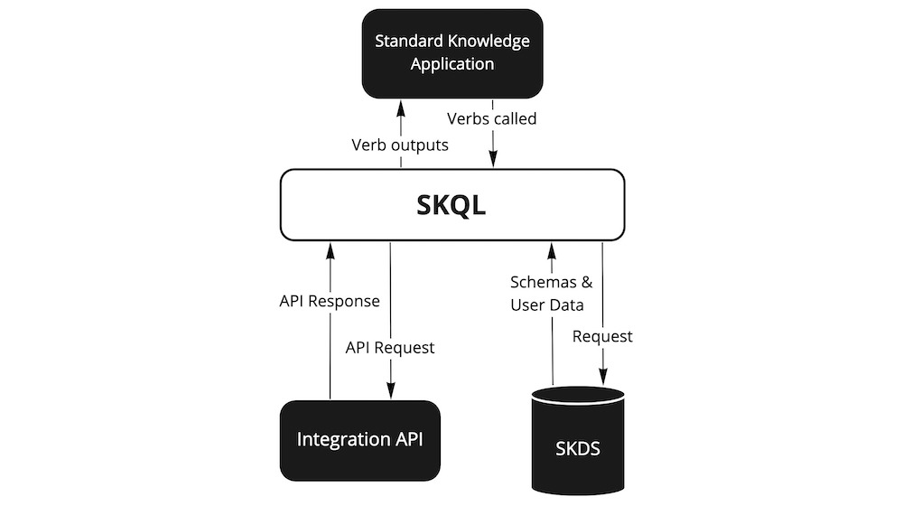

# Ecosystem

In addition to creating a new framework for data integration, the interoperability enabled by SKL Schemas allows us to construct a powerful decentralized ecosystem.

The ecosystem separates storage of user configured schemas and user data from applications. This increases the composability of software and user control over data.

Due to the modular nature of the SKL ecosystem's components, they can be used independently or all together. They include:
- Integrations
- Standard Knowledge Data Stores
- Standard Knowledge Applications

## Integrations

Integrations are software tools which have data and capabilities accessible via an API that SKL can communicate with to query for, mutate, receive messages about, or otherwise access or perform actions over data.

For example:
- [Google Drive](https://www.google.com/drive/) - A file storage tool which has a REST API exposing capabilities to upload, delete, edit sharing permissions, and manage versions of files and folders.
- [MedFusion](https://www.medfusion.com/) - A healthcare IT company which has REST APIs built according to the [FHIR](https://www.hl7.org/fhir/) standards [exposing patients' medical data from John Hopkins Medicine](https://www.medfusion.com/lp/john-hopkins-medicine-patient-data-api/).
- [Go Ethereum](https://geth.ethereum.org/) - An open-source execution client for [the Ethereum Protocol](https://ethereum.org/en/) which has a JSON-RPC API exposing capabilities to get information about blocks, send transactions, and much more.

## Standard Knowledge Data Stores (SKDS)

An SKDS is a type of Integration that stores SKL schema and data conforming to the schema (entities of Nouns, Verbs, and Mappings) for a user. An SKDS is like a secure personal web server for a user's SKL knowledge graph.

- Any kind of information can be stored in an SKDS as long as there is a Noun to describe it.
- Users control access to the data in their SKDS. They decide what data to share and with whom (be it individuals, organizations, or applications). Access can be revoked at any time.
- To store and access data in an SKDS, applications use standard, open, and interoperable data formats and protocols. More on this in the [Solid section below](#solid).

## Standard Knowledge Applications (SKApps)

A Standard Knowledge Application is any software application which stores and accesses data in SKDSs using the SKL protocol.

Instead of each application using a separate data silo that it controls, different applications interact with the same data stored in users' SKDSs. A user gives access to Standard Knowledge Applications to read and/or write schema and data to or from their SKDS.

## Flow of data
This diagram gives more detail about the flow of data in the SKL ecosystem:

Lets assume that a developer is building a Universal File Browser which displays to users all their files and folders from multiple Integrations (eg. Dropbox, Google Drive, OneDrive, etc.). The application contains code which uses [Verbs](./schema-fundamentals.md#verbs) to recursively request and copy the metadata of all files and folders within a user's accounts regardless of what service they exist in so that it may display them to the user.

Instead of the developer storing the metadata about files and folders in a siloed database they control, they store the data in a user's SKDS. SKL includes schema and special Verbs for querying and saving data to SKDSs.

In the future, the user might use another Standard Knowledge Application for signing documents. This application, once authorized by the user to read data from their SKDS, can query for [entities](./schema-fundamentals.md#entity) conforming to the standard File Noun in the SKDS which the user may need to sign. In this way, the two applications can interoperate on the same data because they have a common understanding of its schema.

## Solid {#solid}

SKL's decentralized ecosystem adheres to the principles and interfaces defined in the [Solid Protocol](https://solidproject.org/). Solid is a [specification](https://solidproject.org/TR/protocol) that lets people store their data securely in decentralized data stores called "Pods".

The Solid specification defines how applications can access and manage data from user's personal data stores.
- **[Linked Data](https://www.w3.org/standards/semanticweb/data)** - Solid supports storing Linked Data so that different applications can more easily work with the same data. Specifically, it uses the [Linked Data Platform](https://www.w3.org/TR/ldp/) for accessing, updating, creating and deleting Linked Data resources.
- **[Solid-OIDC](https://solid.github.io/solid-oidc/) Authentication** - defines how the servers hosting personal data stores verify the identity of users and applications based on the authentication performed by an OpenID provider.
- **[Web Access Control](https://solidproject.org/TR/wac) Authorization** - a decentralized cross-domain access control system providing a way for Linked Data systems to set authorization conditions on resources using access control lists.

The components of the SKL ecosystem conform to Solid:
- SKDSs are compliant with Solid's concept of personal data stores called "Pods". This means that any implementation of an SKDS MUST implement Solid-OIDC, Web Access Control, and the Linked Data Platform.
- SKApps are compliant with Solid's concept of Solid Apps. This means that any SKApp should expect to communicate with SKDSs using the Linked Data Platform and authenticate users using Solid-OIDC.

In addition, the SKL ecosystem adds several requirements on top of Solid:
- **Schemas** - Each user's SKDS should store its own schemas. This makes it so that end users can customize and extend SKL as they see fit. When using SKL Verbs, a SKApp should use an [Engine](./engines.md) and set the Engine's schema source to the user's SKDS.
- **Queries & Mutations** - Coming Soon...
