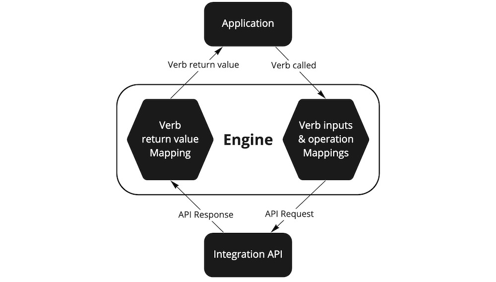

# Build an SKQL Engine

An Standard Knowledge Query Language Engine is a library of code that can read SKL Schemas and execute Verbs and Mappings. An Engine can be built in any programming language that can read the Schema!

We have a prebuilt [SKQL Engine](https://github.com/comake/skql-js-engine) written in Typescript and can be used in any Node.js environment.

## Concepts

In most programming languages and libraries, a function's implementation is defined ahead of time and has a predefined and specific purpose. This is conventional because it reduces ambiguity and allows code to be precise. However, because each language or library has potentially hundreds of function definitions, developers have to read lots of documentation and write code to use the unique functions of each a language or library they need to incorporate.

SKL is different in that it uses Nouns and Verbs more like natural language. In natural language, words we use are sometimes understood contextually based on the other words they are paired with (eg. stiring a pot vs stirring in bed). When a developer calls a Verb using an Engine, the Engine uses the context the Verb was called in to dynamically determine what to do. The context includes what Mappings exist in the schema, and the source Integration and types of the Nouns that were used as arguments to the Verb.

For example, lets say a developer is building a productivity application which displays a user's files from [Dropbox](https://www.dropbox.com/), saved articles from [Medium](https://medium.com/), and tasks from [Asana](https://asana.com/). The developer could build into their application a single interface to "share" any of these files, articles, or tasks with a co-worker. When a user shares something through this interface, the developer's code can call the `share` Verb with a `Person` entity and the entity being shared (a `File`, `Article`, or `Task`) as parameters. The Engine should first search for the configuration of the `share` Verb in the schema to make sure the right parameters were supplied. Then, it will find a Mapping relating the `share` Verb, the source Integration of the entity being shared, and the type of the entity being shared.

In the case that an Asana task is being shared, the Mapping would translate the Person and Task parameters into a web request to the Asana API with the unique parameters, headers, and endpoint URL required. It sends the request then translates the API response into the standard `share` Verb response to return to the developer. This process happens automatically and completely within Engine.

## Implementation

The essential requirements of an Engine are:
1. Allow developers to set a source of schemas.
2. Allow developers to call Verbs.

### Schema source

A developer using an Engine should be able to set the source of the schemas they want the Engine to use at any time via one or several options:
- supplied via a variable
- read from a file
- queried from an SKDS (see [Ecosystem](./ecosystem.md) for more info)

 All examples in this section use the prebuilt Javascript SKQL Engine. 

Supplied via a variable:
```javascript
const schema = [ ... ];
SKQL.setSchema({ schema });
```

Read from a file:
```javascript
SKQL.setSchema({ file: './path/to/schema.jsonld' });
```

Queried from an SKDS:
```javascript
SKQL.setSchema({ storageUrl: 'https://myskds.standard.storage/' });
```

### Verbs

An Engine should support calling Verbs using functions with the same name as the Verb. For example:
```javascript
const files = await SKQL.getFilesInFolder({ account, folder });
```

The Engine may also allow Verbs to be called on entities. When used this way, the entity on which the Verb is called must be one of the Verb's expected parameters. For example the following statements should be equivalent to the one above:
```javascript
const files = folder.getFilesInFolder({ account });
const files = account.getFilesInFolder({ folder });
```

In all three cases, the Engine would call the `getFilesInFolder` Verb with an Account and a Folder as parameters.

This diagram gives more detail about the procedure an Engine should take when a Verb is executed:



The procedure follows these steps:

1. Find the configuration for the Verb from the currently set schema source.
2. Ensure the validity of the parameters supplied according to the [SHACL Shape](https://www.w3.org/TR/shacl/) identified by the Verb’s `parameters` property.
3. Find the configuration for the VerbToIntegrationMapping that relates the Verb to the Integration of the Account parameter from the currently set schema source.
3. Perform the parameter and operation [RML](https://rml.io/) Mapping(s) - defined in the Mapping's `parameterMappings` and `operationMappings` properties respectively - to obtain the unique parameters and operation to perform the Verb using an Integration's API.
4. Perform the Verb’s operation using the Integration's API.
5. Obtain the response from performing the Verb’s operation.
6. Perform the return value [RML](https://rml.io/) Mapping(s) - defined in the Mapping's `returnValueMappings` property - to obtain the return value of the Verb.
7. Ensure the validity of the return value according to the [SHACL Shape](https://www.w3.org/TR/shacl/) identified by the Verb’s `returnValue` property.
8. Return the output of the Verb.


If ever a Verb or a Mapping cannot be found by querying the currently set schema source, the Engine must throw an error.



Execution of [RML](https://rml.io/) Mappings can be performed using an existing RML processor, such as:
- [RMLMapper](https://github.com/RMLio/rmlmapper-java) - an open source Java library to execute RML rules via Java or the command line.
- [rmlmapper-java-wrapper-js](https://github.com/RMLio/rmlmapper-java-wrapper-js) - an open source JavaScript library offering a wrapper around the [Java RMLMapper](https://github.com/RMLio/rmlmapper-java).
- [RocketRML](https://github.com/semantifyit/RocketRML) - an open source Javascript library to execute RML rules.
- [rmlmapper-webapi-js](https://github.com/RMLio/rmlmapper-webapi-js) - an open source library that sets up a web server as a wrapper around the [Java RMLMapper](https://github.com/RMLio/rmlmapper-java).

You can see more RML processors on the [RML Implementation Report](https://rml.io/implementation-report/).



Validation of [SHACL Shapes](https://www.w3.org/TR/shacl/) can be performed using an existing SHACL engine, such as:
- [rdf-validate-shacl](https://github.com/zazuko/rdf-validate-shacl) - an open source SHACL validator written purely in Javascript on top of the [RDFJS](https://rdf.js.org/) stack. Used by our existing SKQL Engine.
- [pySHACL](https://github.com/RDFLib/pySHACL) - an open source SHACL validator library for python.
- [SHaclEX](https://github.com/weso/shaclex) - an open source Scala implementation of SHEX and SHACL.



 <!-- Note about support for different types of operations -->
